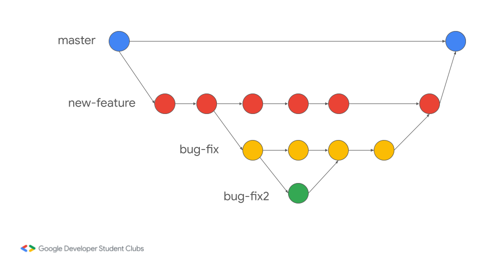
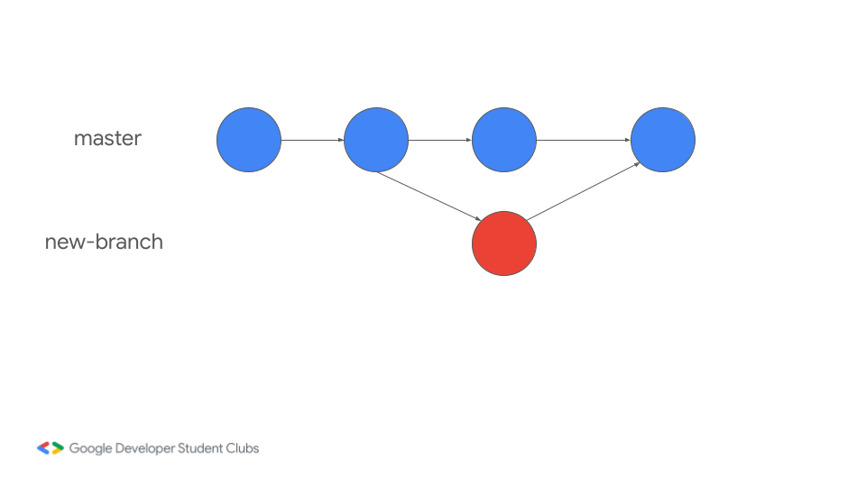
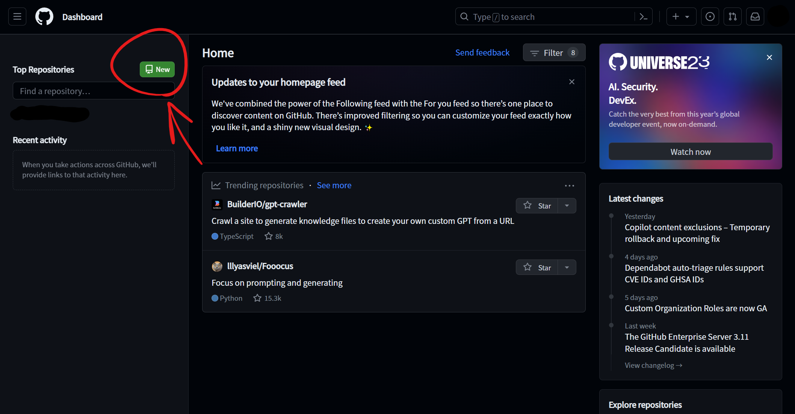
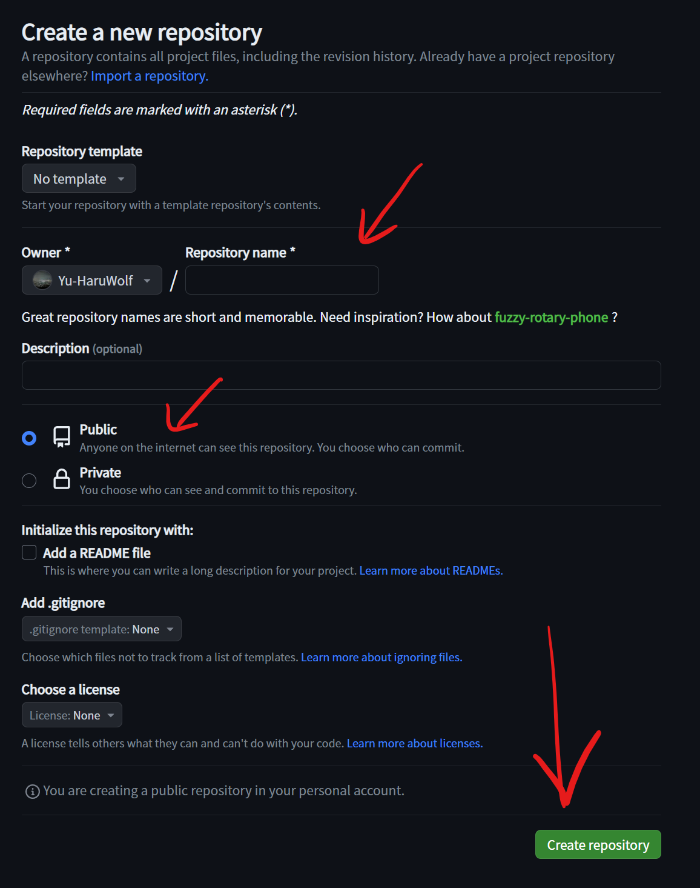
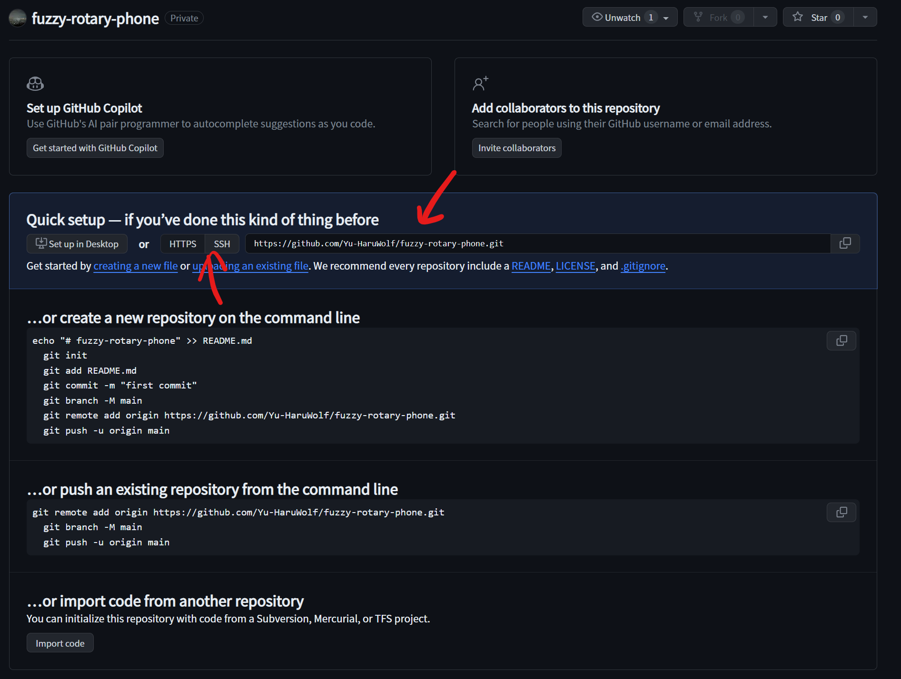
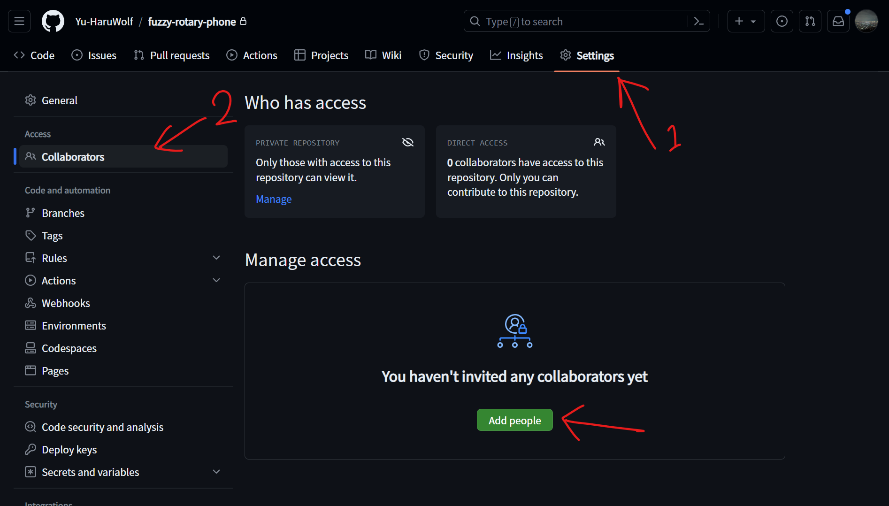

authors: Yuki
summary: Git / GitHub 入門ハンズオン
id: git-github-ja
environments: web
Feedback Link: https://github.com/Yu-HaruWolf/git-workshop-note/issues

# Git / GitHub 入門ハンズオン

## 初めに
Duration: 0:02:00

このcodelabでは、GitとGitHubについての基礎を学びます。
GitやGitHubに関連する単語について解説し、実際に、Gitを操作していきます。
このcodelabを通して、GitやGitHubについて基本的な操作を1通り行うことができます。
※このcodelabに出てくる図などは正確ではない場合があります。

### 前提条件

- インターネットに繋がるPC
- Google アカウント
- GitHub アカウント
- 以下のLinux コマンド知識
  - cd - Change Directory
    - 作業するディレクトリ(フォルダ)を移動する
  - ls - List Segments
    - 作業中のディレクトリの内容を表示する
  - mkdir - Make directory
    - ディレクトリを作成する

## Gitって何？
Duration: 0:08:00

Gitは、プログラムのソースコードなどの変更履歴を記録・追跡するための分散型のバージョン管理システムです。Linux カーネルのような大規模なプロジェクトでも、スピードとデータサイズの両方の面で効率的に管理することができるように、2005年に開発されました。分散型のシステムなので、開発環境がオフラインでもほとんどの機能を利用することができます。また、古いバージョンのファイルを残しておきたい場合にも「file.txt」「新file.txt」のような管理をする必要はありません。

### バージョン管理システムとは？
話をシンプルにするために、まずは分散型という点を無視してお話します。
バージョン管理システムGitのイメージ図です。



丸が登録されたファイルの履歴だと思ってください。
この例では、masterの行(ブランチ)に常に公開用のプログラムが含まれており、new-featureのブランチで新機能を開発しています。新機能の開発の途中で生まれたバグを新機能開発と同時並行で開発するために、bug-fixブランチを増やし、更にバグを直すために人手が必要と判断してbug-fix2のブランチを増やしています。バグ修正が終わったら元のブランチに統合し、新機能が完成したら、masterブランチに統合しています。具体的なイメージをしていると、統合の方法がイメージしづらいかもしれませんが、それは後ほど具体的な説明を行うので、今はなぜかきれいにくっついてしまうと思っていて大丈夫です。
また、これらの丸には全て固有のIDが振られており、いつでもその状態に戻って作業することができます。
これがバージョン管理システムのGitのイメージです。

### 分散型とは？
続いて、分散型のイメージを確認しましょう。


先程確認したバージョン管理システムをサーバー上と、開発者それぞれで実行しているイメージです。基本的にはサーバー上で動作しているバージョン管理システムと同期させながら作業を進めていきますが、開発者はそれぞれ手元でバージョン管理システムが動作しているので、常に同期をさせる必要がありません。オンラインになったときに、各開発者がバージョン管理システムを同期させ、統合すれば良いのです。これがオフラインの開発環境下でも作業ができる理由です。こちらも統合がイメージしづらいかもしれませんが、またなぜかきれいにくっついてしまうと思っていて大丈夫です。

## Gitで出てくる単語
Duration: 0:03:00

ここからは実際の単語と動作を見ながら、基本的な流れを確認していきましょう。

### Repository(リポジトリ)
プロジェクトフォルダと言い換えるとわかりやすいかもしれません。バージョン管理をするフォルダそのもののことです。
### Stage(ステージ)
追加・変更したファイルをGitに登録するための準備場所です。コミットをする際は複数ファイルを登録することが多いです。ただ、変更をすべて登録したいわけではないかもしれません。そこでこのステージに追加するステップを挟むことで、任意のファイルの変更情報をコミットできるようになります。
### Commit(コミット)
ステージにあるファイルの変更情報をGitに登録することです。
### Branch(ブランチ)
直訳だと「枝」です。バージョン管理を枝分かれさせたものを指します。
### Merge(マージ)
並列して行っていた変更を1つにまとめることです。基本的には自動でまとめてくれますが、うまくいかないこともあるので、そこは開発者たちで判断していきましょう。

## Gitを使ってみる
Duration: 0:15:00

実はこれだけで自分1人の環境であれば最低限Gitが使えるようになります。<br>
早速試してみましょう。

### 注意
一般的ではなくなっているコマンドをいくつか使用しています。これはコマンドそのものを使えるようになることより、単語とそれに伴う動作を覚えることを目指しているためになります。そのため、ほとんど同じ動作をする別のコマンドが存在することがあります。<br>
また、コマンドオプションで短縮形が利用できるものがありますが、今回は短縮せずに書いています。<br>
Gitを扱えるソフトウェアは様々なものがあり、Visual Studio Codeといったエディター内でも使えるようになってきていますが、今回はコマンドで操作することをメインで行います。
興味がある方はぜひ GitHub Desktop, SourceTree, TortoiseGit などを調べてみてください。

### 実行環境について
このコードラボでは、[Google Cloud Shell](https://shell.cloud.google.com/?show=terminal)を使用することを推奨しています。
[Google Cloud Shell](https://cloud.google.com/shell?hl=ja)はGoogle アカウントで持っている方であれば、誰でも無料で使うことができるクラウド上のターミナルになります。決済情報の登録も不要です。よく使用される開発環境があらかじめセットアップされた状態になっているので、とりあえず試したい時におすすめです。(しかも半永続の5GBのストレージ付きです！)

もし、手元の環境でコードラボを続行する場合は以下の2つを準備してください。
- [Git](https://git-scm.com/)
- [GitHub CLI](https://cli.github.com/)

(これらのインストールは難しくないので、ぜひ手元の環境でも使えるようにしましょう！)<br>

### Gitの開始
まずは、Gitに関する設定を行います。
変更内容を記録する「コミット」をする際に、そのコミットが誰によるものなのかを記録しておく必要があります。
まずはその設定から行いましょう。

次のコマンドで名前とメールアドレスを設定しましょう。これらの設定項目は基本的に公開されるものになります。
```bash
git config --global user.name “Your Name”
git config --global user.email “example@example.com”
```
※”(ダブルクオーテーション)も必要です

また、gitのデフォルトのブランチ名を「main」に変更しておくことを推奨します。
詳しい理由は説明しませんが、社会情勢的な理由があります。<br>
次のコマンドで変更できます。
```bash
git config --global init.defaultBranch main
```

ここでは、「git-lab1」というディレクトリを作成し、Gitリポジトリにして作業します。
```bash
mkdir git-lab1
cd git-lab1
```
ディレクトリを作成したらカレントディレクトリ(現在のディレクトリ)を作成したディレクトリに変更するのをお忘れなく。<br>
このディレクトリでGitを始めるには次のコマンドを実行するだけです。
```bash
git init
```
シンプルですね。選択肢も出てきません。initはinitializeの略で、初期化する際に使用するコマンドでよく出てきます。<br>
これでGitの準備が完了しました。

## ファイルの変更を記録する
Duration: 0:20:00

設定ができたら、早速作業を始めていきましょう。まずは管理対象のファイルがないと始まりませんね。テキスト形式であればなんでもいいので、とりあえずファイルを作ってみましょう。(バイナリ形式のファイルも管理はできますが、Gitのマージ機能を活かせないのでここでは説明しません。)

※任意のテキストエディタで何かファイルを作ってください。内容は挨拶や自己紹介など好きなものを書いてみましょう。できたら保存して、次のステップに進みましょう。

次のコマンドでgitの状態がどうなっているか確かめましょう。
```bash
git status
```
このようなテキストが表示されましたか？
```
# 出力例です。コピーしないでください。
On branch main 

No commits yet

Untracked files:
  (use "git add <file>..." to include in what will be committed)
        main.py

nothing added to commit but untracked files present (use "git add" to track)
```
※今回はmain.pyというファイルを作成しました。<br>
Untracked files(未追跡のファイル)に作成したファイル名が表示されていますか？もし表示されていない場合は、ファイルが正しく作成されているか確認してください。これ以降のこと全てにおいてそうですが、エラー文が出ている場合はGoogle等で検索したり友人に聞いてみてください。

このままだとgitがファイルの変更を追跡してくれないので、gitにこのファイルの追加記録を書き込みましょう。まずは次のコマンドでステージにファイルを追加しましょう。
```bash
git add main.py
```
※main.pyは作成したファイル名で実行してください。これ以降もファイル名が出てきた場合は、ご自身で作成されたファイル名に置き換えて実行してください。

うまく行けば、何も表示されません。改めて、「git status」で状態を確認してみましょう。
```
# 出力例です。コピーしないでください。
On branch main

No commits yet

Changes to be committed:
  (use "git rm --cached <file>..." to unstage)
        new file:   main.py
```
Changes to be committed(コミットされる変更)に作成したファイルが追加されましたね。これがステージに追加された状態です。もし誤って変更記録に記録したくないファイルを追加した場合は、「`git rm –-cached main.py`」 でステージから削除してください。(ファイルは残ります)<br>
ステージに追加できたら、gitに変更記録を記録しましょう。変更記録にはメッセージが必要になります。変更記録の内容を簡潔にまとめたものを指定できると良いでしょう。(メッセージの書き方はおおよそ決まったものがあり、検索すれば出てきますがここでは触れません。プロジェクト、組織単位でルールを決めて、お互いが分かりやすいものを使用すると良いでしょう。)<br>
次のコマンドでgitに変更記録を記録します。<br>
```bash
git commit --message "Create a first file"
```
これで記録すること(commit)ができました！コミットされた内容の概要が表示されます。コミットされた内容を確認してみましょう。<br>
記録された内容を確認するには次のコマンドを実行します。
```bash
git log
```
次のようなものが出力されます。
```
# 出力例です。コピーしないでください。
commit fa72bb0cdf946f873668c715932e263f0342458b (HEAD -> main)
Author: Yuki <yuki@haruwolf.dev>
Date:   Mon Nov 20 01:22:18 2023 +0000

    Create a first file
```
全てのコミットには固有のIDが振られます。後ろについている「HEAD -> main」では、HEADは現在の状態を表し、mainはブランチ名を表しています。あとは、コミットした人の名前とメールアドレス、コミットした日時、コミットメッセージが表示されていますね。これまで入力した内容が正しく表示されていればここまでバッチリです！<br>
(ちなみにコミットで追加されたファイル、内容は何だったかを具体的に確認する方法がありますが、ひと目見ただけでは少しわかりにくいのでコマンド上で確認する方法はここでは触れません。オンラインのGitHub上で確認する方法は後ほど触れます。)

### TRY
この後のハンズオンのためにも、次のことに挑戦してみましょう！
- コミットしたファイルを変更しましょう。
- 変更内容をコミットしましょう。
  - (実はgit addをしなくても、変更された全てのファイルを一発でコミットする方法があります。ここまで余裕だった方は調べて挑戦してみましょう。)
- コミットできていることを確認しましょう。

## 過去の変更に遡って編集する
Duration: 0:10:00

コーディングをしていると、時々とんでもない量のエラーと遭遇して直せなくなってしまった時、うまく動いていた時に戻りたい時があるかもしれません。gitならそれができちゃいます。早速やってみましょう。<br>
ここまでの内容をしっかりとやってもらえていれば、既にコミットは2回以上行っているはずです。<br>
現在の状態から過去のコミットに遡るには次のコマンドを実行します。
```bash
git checkout fa72bb0cdf946f873668c715932e263f0342458b
```
とんでもなく長いコマンドが出てきましたね。2番目の引数として入っている「fa72bb…(略)」というような文字列を見た覚えはありますか？これはcommitに割り当てられていた固有IDですね。長いので、「git log」からコピペしてしまいましょう。<br>
なお、この時点でコミットしていない変更があると遡ることができません。一時的に退避しておく方法もありますが、後ほど説明するので、ここではコミットで対処しておくことをおすすめします。<br>
checkoutを実行したら、作成したファイルが過去の状態に戻っているか確認してください。<br>
戻ったら、その状態から編集作業を始めたいところですが、実はこのまま始めると結構危ないんです。今過去の変更に遡ったので、ここから変更を行うと、今まで行ってきた変更とは別の時系列へと進んでいくことになります。この時系列に名前を付けないと、元の時系列に戻ったときに変更を失ってしまう可能性が高いです。(detach-切り離し状態)なので、新しくできる時系列(branch)に名前を付けましょう。コミットメッセージと同様に、branch名にも様々な命名規則があります。こちらもここでは触れないので、ぜひ調べて、プロジェクト・組織単位で揃えてください。<br>
次のコマンドを実行して、branchに名前を付けます。
```bash
git checkout -b dev-newMessage
```
実行したら、次のコマンドを実行して、作成したbranchとmain branchの両方があるかどうか確認しましょう。
```bash
git branch
```
また、次のように、新しく作ったブランチが指定されていることを確認してください。(* がブランチ名の前についていれば指定されています。)
```
* dev-newMessage
  main
```
それでは、過去の状態から新しい変更を加えてみましょう。その際、次の条件を満たすような変更を加えてください。
- mainブランチ上で変更記録を行った変更と違う変更を加える。(変更の競合をさせます)
- mainブランチ上で作成していないファイルを作成する。

条件を満たした変更が行えたら、コミットしてください。

## 変更を統合する
Duration: 0:15:00

現在の状態を振り返りましょう。今までの時点で、mainブランチとその途中から派生する新しいブランチの2種類のブランチで進めてきました。<br>
しかし、このまま並走し続けるわけにも行かないので、どこかで統合する必要があります。ここで出てくるのがmerge(マージ)です。今回は、mainブランチに新しく作ったブランチの変更内容をマージすることにしましょう。<br>
今までのイメージと、今回のマージで目指すのは以下のような図です。<br>
<br>
それでは早速やっていきましょう。まずは、まとめる先のブランチに切り替える必要があります。ブランチの切り替えは以下のコマンドでできます。
```bash
git switch main
```
これでmainブランチでの作業に戻ってくることができました。ここに新しいブランチで作業していた内容をマージしましょう。マージは以下のコマンドでできます。
```bash
git merge dev-newMessage
```
これできれいにくっつく、とは行きませんね。gitがマージする上で困るようにファイルを編集しているので、恐らく「CONFLICT」が起こっているのではないでしょうか。(もし起こっていない場合は、gitがうまくマージしてくれたか、そもそもうまくマージできていないかもしれません。ファイルの内容を確認してみて、どのような結果になっているか確認してください。)<br>
ただ、全ての変更内容がうまくマージできなかったわけではありません。新しく作っていたファイルはmainブランチの作業内容に追加されているのが確認できると思います。開発者が確認するべきなのは、CONFLICTが起こった箇所です。実際にファイルの中身を見ていきましょう。
```
<<<<<<< HEAD
print("Hello, World!")
=======
print("Hello, Git!")
>>>>>>> dev-newMessage
```
ファイルの中身がこのようになっているところが、CONFLICT(競合)が起こった箇所です。
イコールで競合した変更内容が区切られており、上下にはgitによる注釈が加えられています。上のHEADが現在の作業中のブランチ、下がマージ元のブランチの変更内容です。開発者はここをいい感じに直してあげればOKです。いい感じと言われるとアバウトですが、その時一番正しいと考えられる状態に直してあげると良いでしょう。<br>
直し終わり、gitによって作成された注釈等も削除し、記録して良い状態になったら、保存をして、いつものようにコミットを行います。マージすること自体も変更記録として記録をします。

ここまで行ったことを`git log`で確認しましょう。ただ、分岐が発生したことで今までのままだと見にくいので、新たなオプションを加えます。
```bash
git log --graph
```
このオプションを加えることで、今までのログに加え、どこでブランチを作成し、どこでマージされたのかが見やすくなります。<br>

ここまではGitのバージョン管理について扱ってきました。gitのバージョン管理の基本的なところはこれで扱えるようになりました。ここまでのことを軽くおさらいしましょう。
- Gitリポジトリの作成(git init)
- Gitに変更内容を記録(git commit)
- 過去の内容に遡る(git checkout)
- 新たなブランチを作成する(git checkout -b)
- 2つのブランチを1つのブランチにまとめる(git merge)

この後は共同開発で使っていくための機能について、説明します。ここからはGitHubを使用するので、まだGitHubのアカウントをお持ちでない方はここで作成しましょう。一旦一休みしましょう。🍵

## GitHubを使ってみる
Duration: 0:10:00

### GitHubって何？
GitHubはソフトウェア開発のプラットフォームで、ソースコードをホスティングしてくれます。コードのバージョン管理システムにGitを使用しており、オンライン上のリポジトリ(リモートリポジトリ)としても使用できます。<br>
<br>
単にホスティングを行ってくれるだけではなく、コードのレビューや、プロジェクト管理、ドキュメント管理、継続的インテグレーションなど、開発を行う上で様々な所でサポートを行ってくれます。最近では、AIを活かしたCopilot機能もリリースされています。今回は扱いませんが、興味がある方はぜひ調べてみてください。<br>

### GitHubに登録する
もし、GitHubのアカウントを持っていない方はアカウントの新規登録をしましょう。
メールアドレスとパスワード、ユーザー名の設定をするだけで登録できます。

[https://github.com/signup](https://github.com/signup)

### GitHubの認証情報をコンピュータに登録する
GitHubの認証情報を用いて手元で作成した内容をオンライン上にアップロードできるようにしましょう。<br>
今回は[GitHub CLI](https://cli.github.com/)を用いて認証を行います。(Google Cloud Shellには既にインストールされています！)

ターミナル上で、次のコマンドを実行します。
```bash
gh auth login
```
次の表示が出るので、`GitHub.com`を選んだ状態でEnterを押してください。
```
? Where do you use GitHub?  [Use arrows to move, type to filter]
> GitHub.com
  Other
```

このコードラボでは、`SSH`を選んだ状態でEnterを押してください。
```
? What is your preferred protocol for Git operations on this host?  [Use arrows to move, type to filter]
  HTTPS
> SSH
```

`Y`と入力し、Enterを押す。
```
? Generate a new SSH key to add to your GitHub account? (Y/n)
```

SSH keyのパスフレーズを決めます。(パスワードのような物です。)任意で設定なので、今回は何も入力せずにEnterを押します。
```
? Enter a passphrase for your new SSH key (Optional):
```

SSH keyのタイトルを決めます。こちらはユーザーが識別できるものであればよいのですが、何も入力しなくても、「GitHub CLI」という名前で登録されます。
今回は何も入力せずにEnterを押します。
```
? Title for your SSH key: (GitHub CLI)
```

GitHubへのログイン方法を聞かれます。
今回は`Login with a web browser`を選択してEnterを押します。
```
? How would you like to authenticate GitHub CLI?  [Use arrows to move, type to filter]
> Login with a web browser
  Paste an authentication token
```

次のような画面が表示されます。
```
! First copy your one-time code: ABCD-0123
Press Enter to open https://github.com/login/device in your browser...
```
Enterを押して、[https://github.com/login/device](https://github.com/login/device)にアクセスします。
アカウントにログインし、表示されていたワンタイムコードを入力する。

設定が完了すると、このような出力が表示されます。
```
✓ Authentication complete.
- gh config set -h github.com git_protocol ssh
✓ Configured git protocol
! Authentication credentials saved in plain text
✓ Uploaded the SSH key to your GitHub account: 
✓ Logged in as Yu-HaruWolf
```

## Git(リモートリポジトリ)で出てくる単語
Duration: 0:05:00

ローカルで使用する語彙は既に触れましたが、リモートで使用する語彙がまだなので、ここで確認していきましょう。
### local / remote
gitにはローカルリポジトリとリモートリポジトリの2種類があり、これにより分散型の管理を実現しています。手元の端末上にあるリポジトリがローカルリポジトリ、GitHub等のサーバーで管理しているリポジトリがリモートリポジトリになります。
### clone
リモートリポジトリをローカルリポジトリにコピーをします。まだ、ローカルリポジトリで作業をしていない場合に使用します。
### push
ローカルリポジトリの内容をリモートリポジトリにアップロードすることです。
### fetch
リモートリポジトリからローカルリポジトリに変更内容を情報として同期させることです。
### pull
リモートリポジトリからローカルリポジトリに変更内容を同期させ、現在の作業内容にマージすることです。

## 作ったリポジトリをGitHubにアップロードする
Duration: 0:15:00

### GitHubのリモートリポジトリを設定する

GitHubにリポジトリをアップロードできるように、まずはGitHub側の準備を整えましょう。<br>
<br>
GitHubの[Dashboard](https://github.com)へ行くと、画面左上に緑色のNewと書いてあるボタンがあるのでクリックします。<br>
<br>
次の画面で、リポジトリ名と、公開するかどうかを設定します。<br>リポジトリ名はGitHubからランダムに提案されたものも選ぶことができます。<br>公開設定に関しては、チーム内だけで共有したいものはPrivateで設定しておくと良いでしょう。<br>
他にもREADMEを追加するかや、gitignoreについてもここで設定できますが、まだ触れていない内容なのでここでは無視します。<br>
設定ができたらCreate repositoryをクリックしてください。<br>
<br>
リポジトリを作成できたら、リモートリポジトリとしてアクセスするためのURLを取得します。<br>
先程のGitHubへのログインコマンドでは、HTTPSではなく、SSHを選択したので、SSHのURLをコピーしてください。<br>

URLが取得できたらシェルに戻ってリモートリポジトリを追加します。<br>
リモートリポジトリの追加は以下のコマンドで行います。<br>
```bash
git remote add origin <URL>
```
originはローカルでリモートリポジトリを識別するための名前です。一般的にoriginが使われることが多いです。<br>
複数のリモートリポジトリを1つのローカルリポジトリで使う場合は名前を変えることがあります。<br>
\<URL>は取得したURLに置き換えてください。<br>

### pushする
リモートリポジトリの追加とブランチ名の変更ができたらいよいよpushします。<br>
pushは以下のコマンドで行います。<br>
```bash
git push --set-upstream origin main
```
コマンドの内容はoriginとして設定されているリモートリポジトリに、mainブランチをpushするということになります。<br>
`--set-upstream`というオプションが指定されていますが、これはmainブランチのデフォルトのpush先としてoriginを指定しておくという意味になります。これで次回以降は`git push`だけでpushできるようになります。

### pushした内容をWeb上で確認する。
GitHub上で作成したリポジトリのページを開いていますか？まだ開いている場合は再読み込みしましょう。<br>
もし閉じてしまった場合は、[github.com](https://github.com)にアクセスして、ページの左からリポジトリを選択してください。<br>
pushした内容がWeb上で確認できましたか？

### 変更内容を確認する。
<br>
ファイル一覧の右上にある~ commitsをクリックしてみましょう。過去のコミット履歴を見ることができます。また、各コミットの変更内容を確認することもでできます。<br>
ただコミット1つ1つを見ていくのは大変なので、コミットメッセージでしっかりと伝わるようにすることを意識していきましょう。<br>

なお、コミットメッセージは1行だけではなく、複数行設定することができます。<br>
以下のようにメッセージの引数を複数作ることで、複数行設定できます。
```bash
git commit --message "Commit message" --message "" --message "Description of commit"
```
なお、一般的に1行目にコミット内容の簡潔な説明をし、2行目は空行にし、3行目以降で具体的な説明を行います。<br>
GitHub上で表示されるのは1行目のコミットメッセージが主に表示され、3行目以降はコミットの詳細を確認した際に表示されます。

## リポジトリをcloneする
Duration: 0:05:00

作成したリモートリポジトリを別の人/パソコンにcloneしてみましょう。とはいえ、いきなり別の人やパソコンを用意するのは大変なので、今回は別のフォルダにクローンすることにしましょう。(ローカルリポジトリは各フォルダに.gitフォルダを生成して管理するのでこの方法でも競合する等は発生しないはずです。)<br>
cloneを行う前に、次のコマンドなどで、作業ディレクトリをリポジトリの外に移動してください。<br>
```bash
cd ..
```
リモートリポジトリをローカルにクローンするには以下のコマンドを実行します。
```bash
git clone <URL> <directory name(Optional)>
```
\<directory name>は省略可能です。省略した場合は、リポジトリ名が使用されます。クローンするためのフォルダは空であることが必須です。<br>
同じリポジトリが2つになりましたか？なお、cloneしたリポジトリにはあらかじめremoteのoriginにcloneで使用したURLが設定されています。(ただし、たまに設定されていないことがあるらしいです。)

## 変更をリモートリポジトリ経由で反映する
Duration: 0:30:00

GitHubにリポジトリをアップロードし、ローカルにも2つのリポジトリができたので、リモート経由で変更を反映してみましょう。<br>
本来であれば、誰かが変更を加えてくれるものですが、今回は自分自身で加えることにしましょう。<br>
次の作業のために以下のことを行ってください。<br>
- 1つ目のリポジトリで変更を加え、commitし、pushまで行ってください。
- 2つ目のリポジトリで変更を加え、commitしてください。(pullやpushはしなくて大丈夫です。この後やります。)

変更を加えコミットをできしても、現時点ではリモートリポジトリ上にpushされた変更内容がローカルにたどり着いていないので、この状態でpushをしても拒否されてしまいます。<br>
なので、1つ目のローカルリポジトリの変更を2つ目のローカルリポジトリに反映、すなわち、変更情報をリモートリポジトリとローカルリポジトリで同期させます。<br>
変更情報の同期は以下のコマンドで実行できます。
```bash
git fetch
```
同期ができると、追加された情報が出力されます。<br>
`git status`を実行すると、リモートとローカルの間に何コミット分差があるのかも確認することができます。<br>
ただ、このままの状態だと変更した情報がローカルに来ただけで、作業内容に反映されていないので、反映された後から作業するためには、mergeする必要があります。この時にmergeコマンドを使用する場合は、ブランチ名等を指定しないで大丈夫です。
```bash
git merge
```
ここでCONFLICTが発生した場合は、解決を行いましょう。<br>
なお、CONFLICTが発生した箇所全てで作業中だったものを使用したい場合は以下のコマンドでも解決することができます。
```bash
git checkout --ours
```
逆に、マージしようとしている方の内容を残したい場合は、以下のコマンドで解決できます。
```bash
git checkout --theirs
```
これらのコマンドは後ろにファイル名を追加して使用することで、一部ファイルだけを指定して残すことができます。バイナリファイルはこのコマンドを使って選択しましょう。

ここまでの内容で、分散型のGitを利用できるようになりました。<br>
同じ動作を行いつつ、少し違うやり方も確認していきましょう。
- fetchとmergeをしたリポジトリで変更を加え、commit, pushしましょう。

`cd`コマンドを利用し、またもう片方のローカルリポジトリのあるディレクトリに移動しましょう。
先程はfetchとmergeを分けて実行しましたが、これらのコマンドはよくセットで実行されます。なので、それ専用のコマンドが用意されています。
```bash
git pull
```
このコマンドを実行すると、fetchとmergeがセットで実行されます。<br>
普段はpullで済ませてしまうことが多いと思います。

ここまでで、GitHubをリモートリポジトリとして扱い、Gitを共同開発で使うための基本的なことを学びました。
ここまでのことを軽くおさらいしましょう。

- GitHubの認証の設定
- GitHubのリポジトリ設定
- GitHubにコードをアップロードする(git push)
- GitHubでコミットした内容と変更を確認する
- GitHubからソースコードを手元にコピーする
- GitHubから変更を取得する(git fetch / git merge -> git pull)
- 変更が競合したら解決する。

## GitHub Features
### はじめに
ここからはGitHubのWeb上で使える機能について説明していきます。ただし、1個ずつ触っていくと時間がかかってしまうので、ここではざっくりとだけの説明になります。時間がある時に色々触ってみてください。
### 共同開発者の追加
プライベートでリポジトリを作成した場合、外部の人からはアクセスすることができません。しかし、他の人と共同開発したいとき、他の人がアクセスできない状態だと困ってしまいます。<br>
なので、共同開発者の追加を行いましょう。<br>
<br>
リポジトリのページに行き、「Settings」→「Collaborators」→「Add people」の順番でクリックします。出てきた入力欄に、追加したい人のユーザー名、名前、メールアドレスのいずれかを入力します。選択したら「Add ~ to this repository」をクリックします。<br>
これで追加する側の設定は終わりです。追加される側は承認する必要があります。<br>
GitHubの右上のお知らせボックスのアイコンに招待が届いています。<br>
招待を開き、「Accept invitation」で招待を承認できます。<br>

### issues
チーム開発の中では、様々な課題や取り組まなければいけないこと、議論すべきことなどが出てきます。そのようなことをまとめる仕組みがGitHubには予め備わっています。<br>
リポジトリページの「Issues」から「New issue」を選択し、取り組むことや課題を登録してみましょう。こちらは人が見るためのものなので、チームメンバーがわかるように書いておけばOKです。また、Issueには担当者やラベルを設定することもできます。ぜひチームのタスク管理に役立ててください。

### pull request
GitでMergeの概念ややり方は既に学習しましたね。<br>
共同開発でも当然複数ブランチに分かれて、最終的に1つのブランチにまとめることはよくあります。しかし、誰か1人の判断でMergeをしてしまうと、予期せぬエラーが発生したり、バグが残されたままになってしまうリスクもあります。そこで、他の人にMergeをしてもよいか確認を求めるpull requestという機能があります。<br>
Pull requestでもissueと同様に議論をしたり、担当者を設定することもできます。<br>
Pull requestを作成するには、リポジトリページの「Pull requests」をクリックし、「New pull request」をクリックします。次の画面で、「base」と「compare」を選択します。baseで選んだブランチにcompareで選んだブランチがマージされます。<br>
2つのブランチの比較が表示されます。そのまま「Create pull request」をクリックして進めます。タイトルと説明を加え、「Create pull request」を加えたら作成完了です。<br>
チームメンバーと相談し、問題がなければ「Merge pull request」でマージすることができます。自動マージできない場合はオンライン上でコンフリクトを解消することができます。<br>
「Close pull request」をマージをせずにPull requestを拒否します。<br>
なお、GitHubに詳しい方が管理しているリポジトリだと、「Merge pull request」がすぐに押せないようになっていることがあります。これは、コードの規約チェックやビルドチェックを含んでいたり、他のメンバーによる承認が必要な設定にしてあることが理由です。デフォルトで有効になっている設定ではないので、なにか問題がある場合は、そのリポジトリの管理者に確認してください。

### Wiki
リポジトリにWikiページを紐づけておくことができます。<br>
もし、チームで常に共有しておくべきルール等があれば、ここに書き残しておくのが良いかもしれません。<br>
ブラウザ上で編集/保存ができるので、特に説明することはありません<br>

### Actions
具体的な説明は難しくなってしまうので、概念だけ説明します。<br>
チーム開発における定期的に行われるタスクを自動化できる機能です。<br>
例えば、皆様に今読んでいただいているこのドキュメントもActionsを使用しています。<br>
リポジトリにコードラボの内容をプッシュすると、コードラボの方に自動的に反映してくれる仕組みです。このおかげで、このコードラボは皆様からのプルリクエスト等を受け付けることができます。(誤った情報や追加情報等大歓迎です！)-->

### GitHub Pages
実はGitHubは動的なWebページでなければホストしてくれちゃいます。<br>
ただし、本番運用向けではないので注意してください。<br>
なお、リポジトリの公開状況に関わらず、GitHub Pagesの内容は公開されます。<br>
ちょっとしたプログラムを見せるだけであればかなり有用な機能なので、ぜひ使ってみてください。

### Web Editor
実はGitHubはオンライン上で編集できてしまいます。<br>
リポジトリのCodeページでキーボードの「.(ドット)」を押してみましょう。<br>
Visual Studio CodeがベースのWeb Editorが表示されます。<br>
簡易的な変更であれば、これでできてしまいます。なお、保存するだけだと変更内容を失う可能性があるので、必ずコミットするようにしてください。(Web Editorの場合、コミットすると自動的にプッシュもされます。)<br>
なお、ターミナルを開いたり、プログラムの実行は行えません。これらをクラウド上で行いたい場合は、この後説明するCodespaceを利用してください。<br>

### Codespace
Web Editorをクラウド上でホストするようにしたものです。<br>
クラウド上で端末が動いているので、プログラムの実行やターミナルも利用できます。<br>
ただし、クラウド上で動作する分、一定利用時間/容量を超えると有料になります。初期設定では勝手に課金されることはありませんが、利用制限がかかります。<br>
また、一定期間利用されない状態が続くと自動的に削除されてしまうので、大事なデータはプッシュしておくか、保存しないようにしましょう。<br>

## Tips(Git)
ここからはGitに関するTipsです。
### .gitignore
プロジェクトを進めていると、バージョン管理をしたくないファイルが出てくることがあります。例えば、プログラムからビルドしたデータや、環境構築すると自動的に生成されるファイルはバージョン管理をしてもあまり意味はなく、人によっては邪魔なものになる可能性もあります。<br>
そのようなファイルを予めバージョン管理から外しておける機能が、`.gitignore`です。利用は簡単で、バージョン管理をしているフォルダに、`.gitignore`を作成し、その中にバージョン管理から外しておきたいファイル名やディレクトリ名を書いておくだけです。ワイルドカードや正規表現の[1-9]も使えます。<br>
ただ、慣れていないと何をバージョン管理から外しておけばよいのかわからないかもしれません。そのような方向けに、GitHubから.gitignoreのレンプレートを用意してもらえています。リポジトリを作成するときも選択肢として.gitignoreの選択欄がありましたね。他にも、[github/gitignore](https://github.com/github/gitignore)のリポジトリに行けば、いつでもgitignoreのテンプレートを取得することができます。<br>
ただし、後からgitignoreにファイルを追加しても、一度コミットされた内容が削除されることはないので、注意してください。<br>
.gitignoreは通常のファイルと同じようにコミットしてプッシュします。

### Gitを使っている時に失敗をしてしまったときは？
バージョン管理システムが動いている状態なら、失敗してしまったことをもとに戻せる可能性があります。<br>
次のコマンドで、そのリポジトリで起きたことの一覧を表示できます。
```bash
git reflog
```
戻したい地点の固有IDを見つけ、チェックアウトします。
```bash
git checkout <ID>
```
もしかしたら、これで失敗を取り返せるかもしれません。(もちろん万能ではないので頼りすぎないでください！)

### ファイルを変更したけれど、やっぱり元に戻したいとき
ファイルをコミットの状態に戻したい場合は次のコマンドで戻すことができます。
```bash
git restore <File name>
```

### ファイルを1つ1つaddするのが面倒
リポジトリ内全てのファイルを対象としたいときは、「.(ドット)」を利用することができます。
```bash
git add .
```

### 間違えてコミットをしてしまった
間違えてコミットをしてしまったときは`git reset`が有効です。
```bash
git reset --soft HEAD^
```
これで直前のコミットを取り消すことができます。<br>
`git reset`という新しいコマンドが出てきましたが、こちらは使い方を誤ると作業内容を吹き飛ばしてしまうコマンドなので、入門の内容としては扱いませんでした。興味があれば調べてみてください。

### マージが終わったブランチはどうする？
基本的に消すのが一般的だそうです。不要なブランチが乱立していると、管理が大変になってしまうことが理由としてあげられます。<br>
なお、コミットを消すということではないので、コミットのログさえたどることができれば、また戻ることができます。<br>
ブランチの削除は以下のコマンドで行なえます。
```bash
git branch --delete <Branch name>
```
なお、GitHubのPull requestを用いてマージを行った場合は、マージを行った後、ブランチの削除のボタンが出てきます。<br>
ローカルとリモートではブランチの削除状況が自動的に同期されないので、注意してください。

### コマンドを打ち続けるのは大変
安心してください。大抵のコード エディターにはバージョン管理のための機能がついています。<br>
そのため、今回ほどコマンドを大量に打つことはしなくても大丈夫です。ただ、Git独自の単語はGUIのものでも出てくるので、今回のコマンドから単語を覚えていただけていれば幸いです。<br>
また、細かい動作を行う場合はやはりコマンドが一番融通が効くので、その意味でも今回はコマンドで行いました。
エディターには「VCS」や「Version Control」、Gitのイメージアイコンで機能が用意されていることが多いです。探してみてください。<br>

### ブランチはどのように分ければ良い？
基本的には、チームで分け方を決めておくと良いと思います。<br>
ただいきなりそんなことを決めようとなってもイメージがつきにくいと思うので、一例にはなりますが、Git Flowを紹介したいと思います。

Git Flowでは以下のようなブランチを用意します。
- master(main) ブランチ
    - リリース用のブランチ
    - このブランチでは直接作業しない
- develop ブランチ
    - 開発用のブランチ
    - コードが安定し、リリース準備が整ったら、releaseブランチへマージする
    - このブランチでは直接作業しない
- feature ブランチ
    - 機能の追加用ブランチ
    - developブランチから分岐する
    - リリース準備ができたらreleaseへマージする。
- hotfix ブランチ
    - リリース後の緊急対応用ブランチ
    - masterブランチから分岐する
    - 解決したら、masterブランチにマージすると共に、developブランチにもマージする
- release ブランチ
    - リリース準備用のブランチ
    - リリース準備が整ったら、masterブランチにマージすると共に、developブランチにもマージする

全てのブランチを全てチームで守るようにする必要はありませんが、これらを守るようにしておくとチーム内での衝突が起きにくくなったり、本番環境と開発環境の区別が明確になったりします。<br>
他にも、ブランチの種類を最小限にしたGitHub Flow等もあります。ぜひ、チームに合ったスタイルを見つけてください。

## 終わりに
これで内容は終わりです。お疲れ様でした。皆様のチーム開発に役立つことができれば幸いです。<br>
私自身Gitを完璧に扱える人ではないので、誤った情報や不足している情報があるかもしれません。<br>
よろしければ、IssueやPull requestで修正点を教えていただけると非常に助かります。<br>
